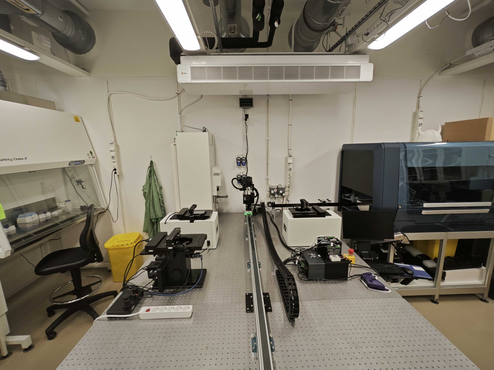

# REEF Imaging

A platform for automated microscope control, image acquisition, data management, and analysis for reef biological experiments.

## Overview

REEF Imaging provides a comprehensive system for automated microscopy workflows, integrating hardware control, cloud-based data management, and real-time monitoring. The system enables fully automated time-lapse experiments with:

- **Hardware Control**: Seamless integration with SQUID microscopes, Dorna robotic arms, Cytomat incubators, and the Hamilton liquid handler
- **Image Acquisition**: Multi-channel fluorescence and brightfield imaging with automated well plate scanning
- **Data Management**: Cloud-based storage and organization through the Hypha platform with artifact management
- **Orchestration**: Task-driven workflow automation with real-time status tracking and error recovery
- **Remote Operation**: Mirror service architecture enabling secure cloud-to-local hardware control
- **Live Monitoring**: Real-time camera streaming from lab USB cameras and RealSense arm camera
- **Image Processing**: Utilities for image manipulation, stitching, and format conversion

## Architecture

### System Components

The REEF Imaging system is built on a modular architecture with four main layers:

1. **Orchestration Layer** (`reef_imaging/orchestrator/`)
   - Task scheduling and management from `config.json`
   - Hardware coordination (microscope, robotic arm, incubator, Hamilton executor)
   - Admission-controlled busy rejection for transport and scan conflicts
   - Health monitoring with automatic reconnection
   - Critical operation protection and error recovery

2. **Hardware Control Layer** (`control/`)
   - **Microscope Service**: Stage positioning, multi-channel imaging, autofocus
   - **Robotic Arm Service**: Sample transport with preconfigured paths
   - **Incubator Service**: Sample storage, environmental monitoring (temperature, CO2)
   - All services expose standardized APIs through Hypha RPC

3. **Mirror Service Layer** (`mirror-services/`)
   - Cloud-to-local service proxies for remote operation
   - Automatic method mirroring for robotic arm, incubator, and Hamilton executor
   - Health checks with auto-reconnection
   - Note: Microscope has built-in mirror functionality

4. **Data Management Layer** (`hypha_tools/`)
   - Artifact management for cloud storage organization
   - Automated uploaders for experiment data
   - Gallery and dataset creation
   - Concurrent batch uploads with resume capability

### Communication Flow

```
Cloud (Hypha Server: hypha.aicell.io)
    ↕️ (RPC)
Mirror Services (robotic arm, incubator, Hamilton executor)
    ↕️ (RPC)
Local Hypha Server (reef.dyn.scilifelab.se:9527)
    ↕️ (RPC)
Orchestrator ← Hardware Services (microscope, robotic arm, incubator, Hamilton executor)
    ↕️
Physical Hardware
```

## Lab Setup



Check out our system demonstration video:
[REEF Imaging System Demo Video](https://drive.google.com/file/d/1nQLgzMsSR3JCzMfe99mdpwYSvpYZAS7q/view?usp=sharing)

## Project Structure

- **reef_imaging/** - Main package
  - **orchestrator/** - Main orchestration package (6 modules: core, health, transport, tasks, api, __init__)
  - **hypha_service.py** - Hypha service integration
  - **control/** - Hardware control modules
    - **dorna-control/** - Control for Dorna robotic arm
    - **cytomat-control/** - Control for Cytomat incubator
    - **squid-control/** - Control for SQUID microscope (includes built-in mirror functionality)
    - **mirror-services/** - Services for mirroring data between cloud and local systems (robotic arm, incubator, and Hamilton executor)
  - **hypha_tools/** - Utilities for working with the Hypha platform
    - **artifact_manager/** - Tools for interacting with Hypha's artifact management system
    - **automated_treatment_uploader.py** - Uploads time-lapse experiment data
    - **automated_stitch_uploader.py** - Processes and uploads stitched images
  - **lab_live_stream/** - Camera livestream services
    - **lab_cameras.py** - 2× USB lab cameras on Linux (services: `reef-lab-camera-1`, `reef-lab-camera-2`)
    - **realsense_camera.py** - RealSense camera on robotic arm (service: `reef-realsense-feed`)
    - **lab_cameras_watchdog.py** - Linux systemd watchdog for lab cameras

## Installation

First, clone the repository and set up the environment:

```bash
git clone git@github.com:aicell-lab/reef-imaging.git
cd reef-imaging
conda create -n reef-imaging python=3.11 -y
conda activate reef-imaging

# Install squid-control in editable mode (includes built-in mirror functionality)
git clone git@github.com:aicell-lab/squid-control.git
pip install -e squid-control

# Install the package and its dependencies
pip install -e .
```

## Usage

### Start Hypha Server

Before starting, make sure you've installed Docker and docker-compose.

1. **IMPORTANT**: Set permissions for HTTPS
   ```bash
   chmod 600 traefik/acme/acme.json
   ```

2. Create an `.env` file based on the template in `.env-template`

3. Configure your settings in `docker/docker-compose.yaml`

4. Create the Docker network
   ```bash
   docker network create hypha-app-engine
   ```

5. Start the application containers
   ```bash
   cd docker && docker-compose up -d
   ```

6. Start the traefik service
   ```bash
   cd traefik && docker-compose up -d
   ```

7. After a few minutes, your site should be running at https://reef.aicell.io

### Start Hypha Services

To run the main service:
```bash
python -m reef_imaging.hypha_service
```

### Running the Orchestrator

**Production Mode** (with real hardware):
```bash
python -m reef_imaging
```

The orchestrator auto-connects to both the local Hypha server (for hardware services) and the cloud Hypha server (to register its own service). No CLI flags are required.

For simulation testing (no hardware):
```bash
python -m reef_imaging.orchestrator_simulation
```

The orchestrator will:
1. Connect to the local and cloud Hypha servers
2. Discover and connect to hardware services
3. Load tasks from `config.json`
4. Begin processing pending time points
5. Monitor service health and automatically reconnect on failures

Hamilton-specific orchestrator contract:

- `transport_plate(from_device, to_device, slot=...)` remains the only physical movement API, including routes touching `hamilton`
- `get_hamilton_status()` reports Hamilton executor connectivity, executor status, and active Hamilton-related operations
- `run_hamilton_protocol(script_content, timeout=3600)` starts simple Hamilton script content only and returns immediately with an `action_id`

Recommended composed workflow:

1. `transport_plate(..., "hamilton", ...)`
2. `run_hamilton_protocol(script_content=...)`
3. Poll `get_hamilton_status()` until the Hamilton executor is idle again
4. `transport_plate("hamilton", ..., ...)`

### Critical Hardware Smoke Test

Use the hardware smoke test before relying on a new lab setup, after device integration changes, and after safety-critical orchestration changes.

This is a **real hardware test**. It moves plates with the robotic arm, accesses the incubator, and runs a short microscope scan on each configured microscope. A trained person MUST stay **on site in the lab for the entire run**. Do not run it unattended or remotely.

Start the normal local services and the running orchestrator first, then run:

```bash
reef-hardware-smoke-test
```

The CLI will:
- Query the running local orchestrator on Hypha
- List available incubator samples
- Let the operator select 1 to 5 samples
- Run each selected sample through every configured microscope sequentially
- Ask for confirmation before each cycle
- Stop immediately on the first failure
- Offer emergency actions to cancel a scan or halt the robot
- Save a timestamped report under `hardware_test_reports/`

Hamilton smoke-test modes validate transport only. They do not execute Hamilton liquid-handling scripts; use `run_hamilton_protocol(...)` separately once the plate is already on Hamilton. The intended `script_content` should stay very simple: constants plus direct staged helper calls, with imports and helper wiring handled server-side.

### Starting Individual Hardware Services

**Incubator Control**:
```bash
cd reef_imaging/control/cytomat-control
python start_hypha_service_incubator.py --local
```

**Robotic Arm Control**:
```bash
cd reef_imaging/control/dorna-control
python start_hypha_service_robotic_arm.py --local
```

**Microscope Control**:
```bash
cd squid-control  # External package
python start_hypha_service_squid_control.py --local
```

**Mirror Services** (for cloud operation):
```bash
cd reef_imaging/control/mirror-services
python mirror_incubator.py
python mirror_robotic_arm.py
python mirror_hamilton.py
```

### Starting Lab Camera Services (Linux)

The lab camera service auto-detects connected USB cameras and registers them as Hypha streams:

```bash
# Run directly
python reef_imaging/lab_live_stream/lab_cameras.py

# Or via systemd (after installation)
sudo systemctl start lab-cameras
sudo systemctl start lab-cameras-watchdog
```

Live stream URLs should be retrieved via the orchestrator tool
`get_lab_video_stream_urls`. On the current deployment this mapping can include
the lab cameras and the Hamilton camera feed.
See `reef_imaging/lab_live_stream/README.md` for full setup and watchdog instructions.

## Environment Setup

### Environment Variables

The system requires environment variables for authentication and configuration. Create a `.env` file in the project root:

```bash
# Cloud Operation (Hypha: hypha.aicell.io)
REEF_WORKSPACE_TOKEN=your_cloud_token_here
SQUID_WORKSPACE_TOKEN=your_squid_token_here

# For local development
REEF_LOCAL_TOKEN=your_local_token
REEF_LOCAL_WORKSPACE=your_local_workspace
```

## Hardware Control Services

The system integrates with multiple hardware components:

- **Microscope Control**: Manages SQUID microscope for imaging, stage positioning, and illumination (includes built-in mirror functionality)
- **Robotic Arm Control**: Handles sample transfer between microscope and incubator
- **Incubator Control**: Manages sample storage and environmental conditions
- **Hamilton Executor**: Runs Hamilton Python protocols through the existing `hamilton-script-executor` service
- **Mirror Services**: Proxies requests between cloud and local systems (for robotic arm, incubator, and Hamilton executor)

### Using the squid_control Package

The `squid_control` package now includes built-in mirror functionality, eliminating the need for a separate `mirror_squid_control.py` service. This simplifies the setup and provides better integration between local and cloud operations.

For more information about the `squid_control` package and its mirror features, visit: https://github.com/aicell-lab/squid-control

## Restart Hypha

```
cd docker && docker-compose restart hypha
```

## Documentation

For more detailed information, see the README files in each subdirectory:
- `reef_imaging/README.md` - Main codebase overview
- `reef_imaging/control/README.md` - Hardware control systems
- `reef_imaging/hypha_tools/README.md` - Hypha integration tools
- `reef_imaging/hypha_tools/artifact_manager/README.md` - Artifact management utilities
