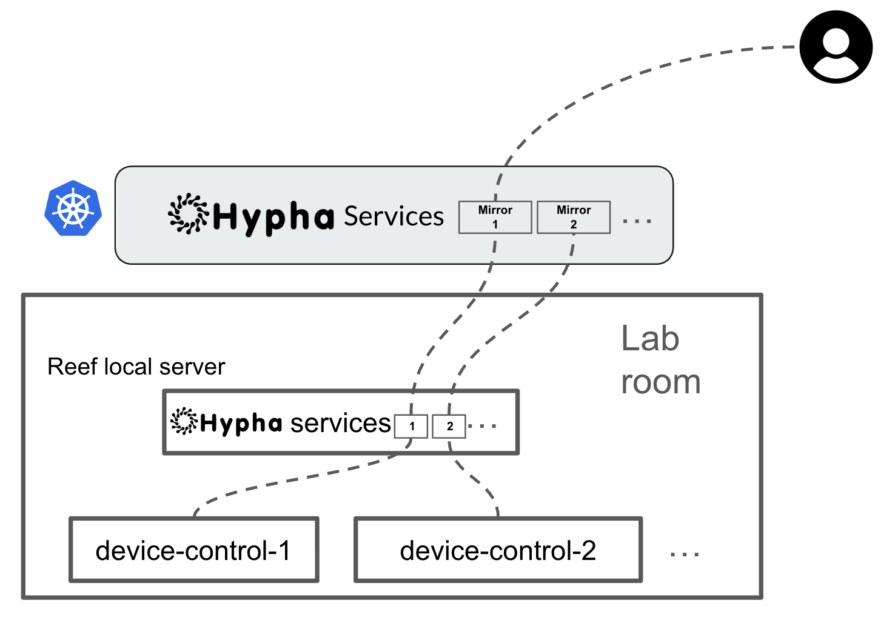

# REEF Imaging Mirror Services

This directory contains mirror services that proxy requests from the cloud server (https://hypha.aicell.io) to the local REEF imaging services. These services allow remote control of the microscope, robotic arm, and incubator while maintaining local control and safety measures.

## Services Overview

1. **Mirror Robotic Arm Service** (`mirror_robotic_arm.py`)
   - Mirrors the local robotic arm control service
   - Manages sample transfer between microscope and incubator
   - Provides movement control and status monitoring

2. **Mirror Incubator Service** (`mirror_incubator.py`)
   - Mirrors the local incubator control service
   - Handles sample storage and environmental control
   - Monitors temperature, CO2 levels, and sample status

**Note**: The microscope control mirror service (`mirror_squid_control.py`) has been removed. The `squid_control` package now includes built-in mirror functionality, eliminating the need for a separate mirror service. See the main project README for information on using the `squid_control` package with mirror features.

## Prerequisites

- Python 3.7+
- `hypha_rpc` package
- `python-dotenv` package
- Access to both local and cloud Hypha servers

## Environment Setup

Create a `.env` file in the mirror-services directory with the following variables:

```env
REEF_WORKSPACE_TOKEN=your_cloud_token_here
REEF_LOCAL_TOKEN=your_local_token_here
MICROSCOPE_SERVICE_ID=microscope-control-squid-1
```

## Running the Services

### Starting Individual Services

Each mirror service can be run directly as a Python script. You can start them individually in separate terminal sessions:

```bash
# Terminal 1: Start robotic arm mirror service  
python mirror_robotic_arm.py

# Terminal 2: Start incubator mirror service
python mirror_incubator.py
```

**Note**: The microscope mirror service is no longer needed as the `squid_control` package includes built-in mirror functionality.

### Customizing Service IDs

Each service accepts command-line arguments to customize the service IDs:

```bash
# Custom robotic arm service IDs
python mirror_robotic_arm.py --cloud-service-id "my-mirror-robotic-arm" --local-service-id "my-local-robotic-arm"

# Custom incubator service IDs
python mirror_incubator.py --cloud-service-id "my-mirror-incubator" --local-service-id "my-local-incubator"
```

**Note**: Microscope mirror service customization is now handled through the `squid_control` package configuration.

### Running Services in Background

For production use, you can run services in the background using `nohup` or `screen`:

```bash
# Using nohup
nohup python mirror_robotic_arm.py > robotic_arm.log 2>&1 &
nohup python mirror_incubator.py > incubator.log 2>&1 &

# Using screen (install with: sudo apt-get install screen)
screen -S robotic_arm -dm python mirror_robotic_arm.py
screen -S incubator -dm python mirror_incubator.py
```

**Note**: Microscope mirror service is no longer needed as the `squid_control` package handles mirroring internally.

### Service Management

- The services will automatically reconnect if the connection is lost
- Health checks run every 30 seconds
- Press Ctrl+C to gracefully stop the services
- All operations are logged to service-specific log files

## Service URLs

- Cloud Server: https://hypha.aicell.io
- Local Server: http://reef.dyn.scilifelab.se:9527

## Service IDs

- Mirror Robotic Arm Service: `mirror-robotic-arm-control`
- Mirror Incubator Service: `mirror-incubator-control`

**Note**: Microscope mirror service ID is now managed by the `squid_control` package.

## Logging

Each service maintains its own log file:
- `mirror_robotic_arm_service.log`
- `mirror_incubator_service.log`

**Note**: Microscope mirror service logging is now handled by the `squid_control` package.

Log files use rotating file handlers with a maximum size of 100KB and keep 3 backup files.

## Health Monitoring

All services include:
- Automatic reconnection to local services
- Task status tracking
- Error handling and logging
- Service health checks every 30 seconds

## Error Handling

- All operations include comprehensive error handling
- Errors are logged with full stack traces
- Services attempt to reconnect automatically on failure
- Failed operations return appropriate error messages

## Security

- All connections require authentication tokens
- Separate tokens for local and cloud access
- Environment variables used for sensitive information
- No direct hardware control - all operations proxy through local services 